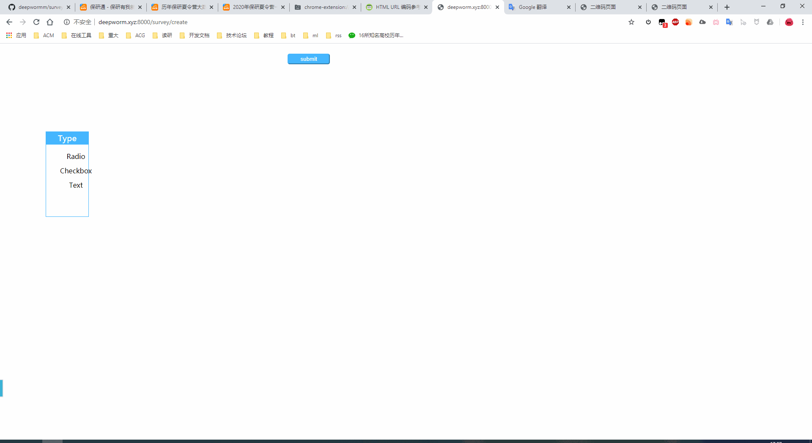

# readme for survey application

## For lab2

Android Survey core project for a primary design practice using Android Studio.

陈潇涵 email_address:120512900@qq.com  
张义 email_address:deepworm@qq.com  
王丹豪 email_address:wang904183923@163.com  
郭俊帅 email_address:conquerfate9@gmail.com  
岑秋兰 email_address:1303214164@qq.com

## For coding activity 8 and mini

### members

| Name(En) |  CQU ID  |                 rep                 |                                        job                                        |
| :------: | :------: | :---------------------------------: | :-------------------------------------------------------------------------------: |
|    DW    | 20171714 | https://github.com/deepwormm/survey | database design, web services, showsurvey page,readme.md,http communication guide,make gif and video |
|   Dean   | 20171744 | https://github.com/Dean0110/survey |                                  android client                                   |

### Requirements/Platform

- server
  - wordcloud 1.6.0
  - django 3.0.3
  - python 3.6
- android client
  - Android 10 or above

### Installation

install android-client/build/survey.apk

### Usage

#### For survey creators

- from web: open deepworm.xyz:8000/survey/create in browser, create the survey, click the button and you will get a QR Code. Let your surveyed scan the QR Code with our android client. A url will be given below the QR Code. Remember to save that url so you can see your statistical survey result whenever you want.
  
- from android: For the surveyed: download and install android-client/survey.apk. Click  to ]]create a new survey.

#### For the surveyed

You need to download and install android-client/survey.apk, scan the QR Code given and finish the survey


### How Does it work

The survey creator should create a survey at [create page](deepworm.xyz:8000/survey/create) or at android client(same as the surveyed). And a QR Code will be given, which contains a url to get survey data. Then the surveyed should install [survey.apk](./android-client/survey.apk) and scan the QR Code. After finishing the survey, the surveyed should click the "Submit" button and the survey result will be uploaded.

### Completed functions

#### Password to keep safe

When the android client is install, you can initialize a password to protect your android client. When anyone finished the survey, he will need the password to exit the android app.

#### Create new questionnaire easily

You don't need to be a profession to create a survey -- everyone can. You only need install our app or visit our website to create a survey.

#### Scan QR code to load questionnaires

The surveyed can scan a QR Code to load any survey.

### Uncompleted functions

Android client can't submit survey result now.   
Android apk is not packed yet.

### API

#### deepworm.xyz:8000/survey/create

It returns a webpage where you can create your survey.

#### deepworm.xyz:8000/getsurvey/<int:surveyid>

Get this url, and the server will return the survey json string.

#### deepworm.xyz:8000/savesurvey

Post your survey json string to here. The json string should be in "content" field.  
Then the server will return you a Integer which means the survey Id.

Sample:  
the survey json string:

```json
{
  "survey": {
    "len": "3",
    "questions": [
      {
        "type": "radio",
        "question": "请输入单选描述",
        "options": [
          {
            "1": "选项1"
          },
          {
            "2": "选项2"
          }
        ]
      },
      {
        "type": "checkbox",
        "question": "请输入多选描述",
        "options": [
          {
            "1": "选项1"
          },
          {
            "2": "选项2"
          },
          {
            "3": "选项3"
          }
        ]
      },
      {
        "type": "text",
        "question": "请输入文本框描述"
      }
    ]
  }
}
```

#### deepworm.xyz:8000/submitsurvey/<int:surveyid>

Post your survey result json string here.

sample survey result string:

```json
{
  "surveyId": 19,
  "length": 3,
  "data": [
    {
      "type": "radio",
      "question": "What's your gender?",
      "option": {"1": "male"}
    },
    {
      "type": "checkbox",
      "question": "What smartphone brands do you like?",
      "option": {"1": "Huawei", "2": "Xiao Mi"}
    },
    {
      "type": "text",
      "question": "What do you care aboud most when buying a smartphone?",
      "option": {"1": "appearance"}
    }
  ]
}
```

#### deepworm.xyz:8000/showsurvey/<int:surveyid>

The survey result is shown here.

- bar charts for single questions.
- fan charts for checkbox questions.
- word cloud maps for text questions.

### Contact us

you can contact us by deepworm@qq.com or wang904183923@163.com

### FAQ

Q: Why I can't visit the website?  
A: Please contact me(deepworm@qq.com)
